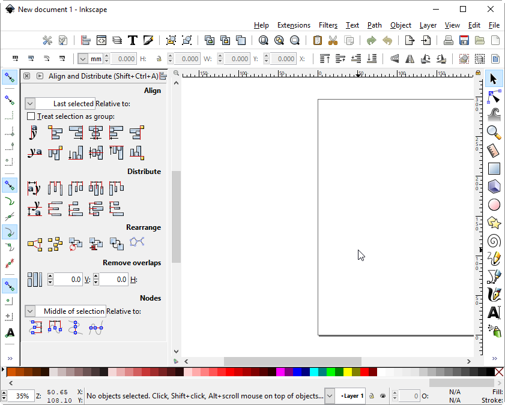

# Inkscape

[Homepage](https://inkscape.org/en/)

[Bug](https://bugs.launchpad.net/inkscape/+bug/1471575)

Inkscape will align all menus and UI RTL as long as an RTL language is present. The current workaround is removing the RTL language from `C:\Program Files\Inkscape\share\locale`.

