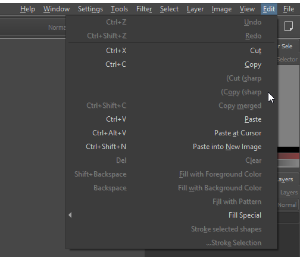
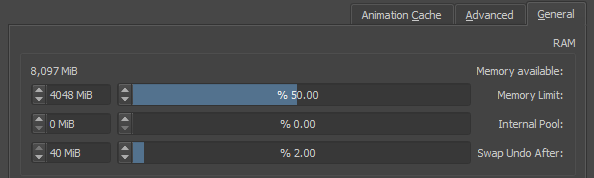

# Krita

[Homepage](https://krita.org/en/)

[Bug](https://bugs.kde.org/show_bug.cgi?id=399440)

I am running Windows 10.
System language is English
Locale is Hebrew (though changing it did not seem to have an effect)
Language list includes both English and Hebrew.
Krita language is set to English.

In the screenshots, you can see multiple issues:

1. English text is RTL-aligned, resulting in misplaced parentheses;
2. Labels placed to the wrong side of widgets;
3. Some text appears in Hebrew regardless of the chosen language.

